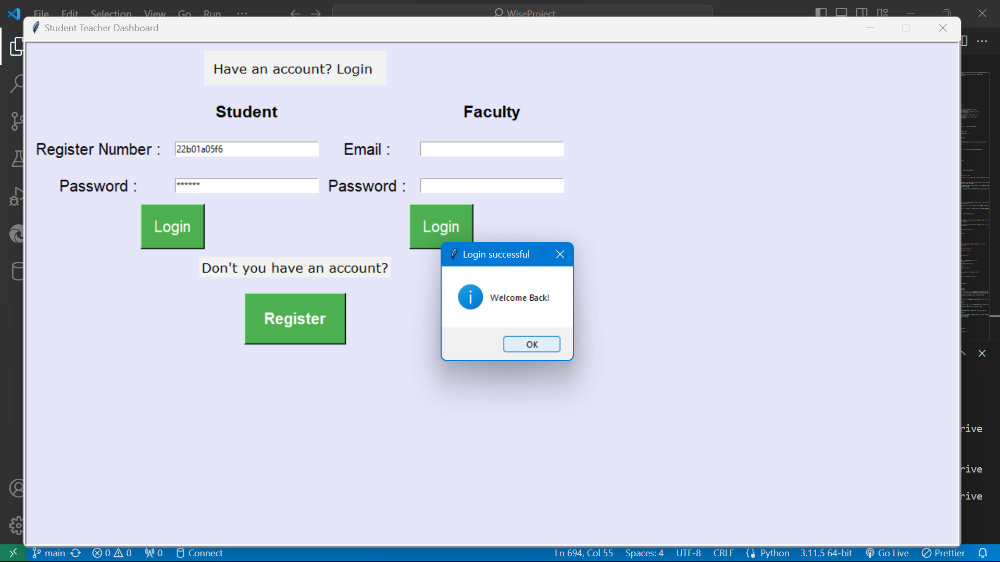
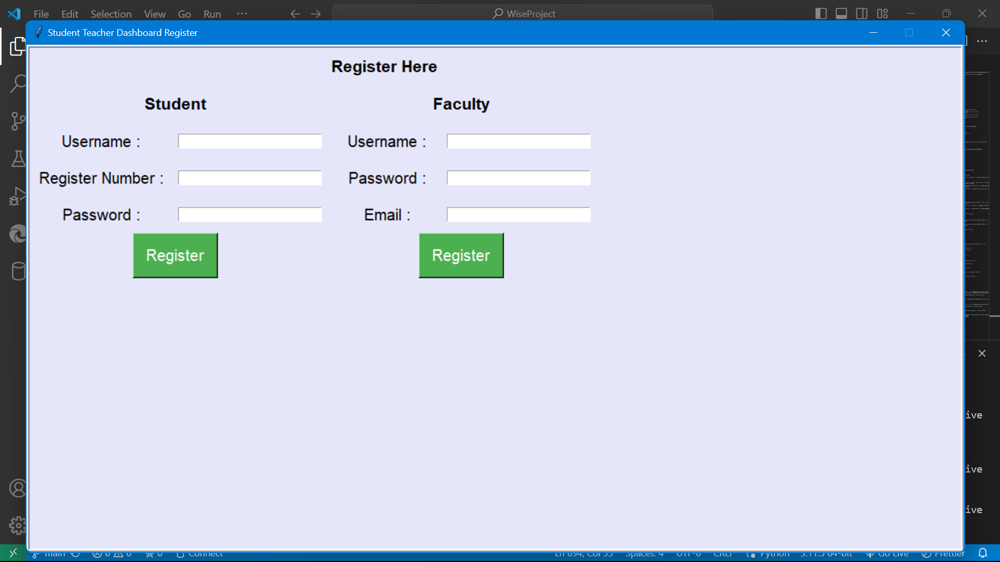
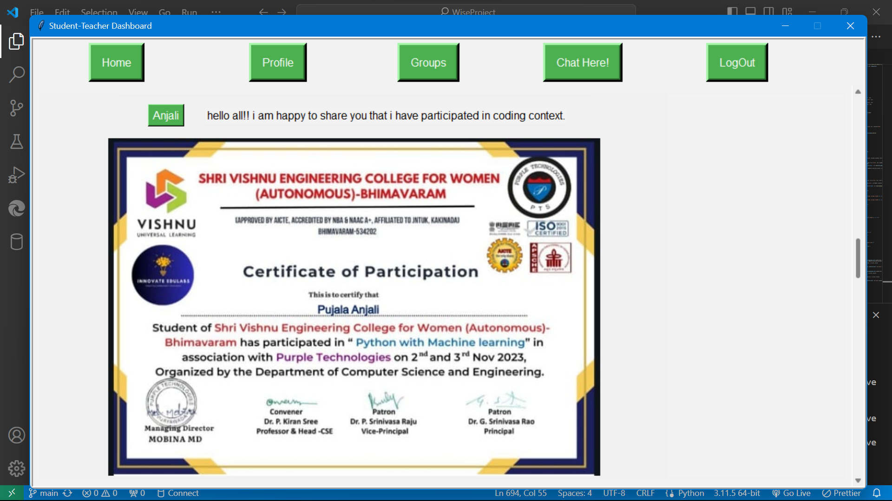
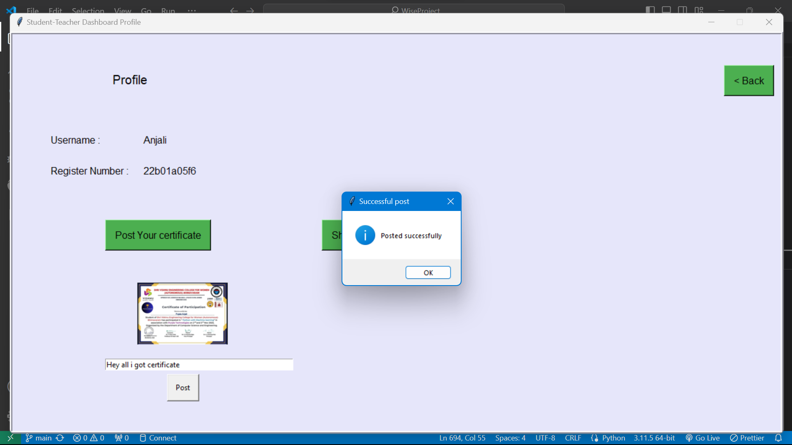
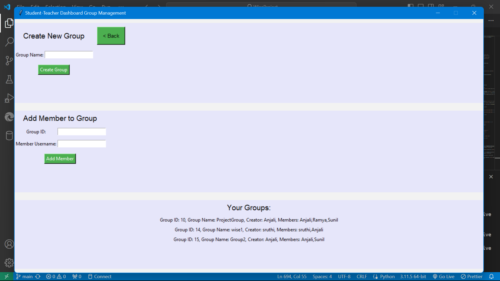

# StudentTeacherDashboard

This is a student-teacher dashboard application built using Python and MySQL. The application provides functionalities for both students and faculty members to manage their profiles, access groups, and engage in chats.

## Features

- **Login and Registration**: Users can log in or register as a student or faculty member.
- **Profile Management**: Users can view and manage their profiles, including uploading profile pictures and personal information.
- **Group Management**: Faculty members can create and manage groups, allowing them to add or remove members.
- **Chat**: Users can engage in real-time chat sessions with other users, facilitating communication and collaboration.

## Prerequisites

- Python 3.x
- MySQL

## Installation

1. Clone the repository:

    ```bash
    git clone https://github.com/AnjaliPujala/StudentTeacherDashboard.git
    ```


2. Set up MySQL database:
    - Create a MySQL database named `mydatabase`.
    - Update MySQL credentials in the code (`host`, `user`, `password`).
    - ```
      create table userdata(
           uname varchar(20),
           regno varchar(10),
           pass varchar(20),
           primary key(regno) );
      ``` 
     - ```
       create table teacher_data(
	    faculty_name varchar(20),
        faculty_id int auto_increment primary key,
        f_pass varchar(20),
        email varchar(30)
       );
   ```
  - ```
    CREATE TABLE imagedata (
	imgid INT auto_increment primary KEY,
    img longblob,
    regno varchar(10),
    faculty_id INT,
    descript varchar(100),
    foreign key(regno) references userdata(regno),
    foreign key(faculty_id) references teacher_data(faculty_id)
    );
    ``` 
  - ```
    create table groups_data(
    group_id int auto_increment primary key,
    group_name varchar(20),
    creator_username varchar(20),
    members text
    );
    ```

3. Run the application:

    ```bash
    python main.py
    ```

## Usage

- Upon running the application, users will be presented with a login or registration screen.
- After logging in, users can access their respective dashboards, manage profiles, access groups, and engage in chats.
- Students can view their profile information, upload certificates, and view posts related to their courses.
- Faculty members can view their profile information, upload certificates, and manage groups.

## Screenshots


*Login Screen*


*Register Interface*


*Home Interface*


*Profile Management*


*Group Management*


